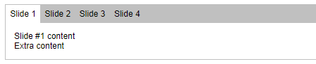

# TSX (JSX) XAML-like Render Template Props

[**Online demo**](https://tomashubelbauer.github.io/tsx-xaml-render-props)

```jsx
<Toggle title="Test" checked>
  <Toggle.OnContent>checked!</Toggle.OnContent>
  <Toggle.OffContent>unchecked!</Toggle.OffContent>
  ⭐
</Toggle>
```


```jsx
<Slider orientation="horizontal" childrenPlacement="slide">
  <Slider.Slide title="Slide 1">Slide #1 content</Slider.Slide>
  <Slider.Slide title="Slide 2">Slide #2 content</Slider.Slide>
  <Slider.Slide title="Slide 3">Slide #3 content</Slider.Slide>
  <Slider.Slide title="Slide 4">Slide #4 content</Slider.Slide>
  <div>Extra content</div>
</Slider>
```



This repository demonstrates an alternative to a React pattern called *render props*.
Render props are regular React props whose values are functions which receive data and generate React elements.

The reason render props exist is that in React, components by default have a single `children` prop, but many components
lend themselves better to a scenario where two or more distinct sets of children would be suitable.

One example of this is a switch-like component: a single set of props here is not of much use, ideally, we would have
two sets of props, one for each state - switch is on, switch is off.

In simple cases like this it is possible to pass children through normal props, so render props do not necessarily always have to be
functions.

There are more complex cases though, like a table-like component, where one props is used for a dataset (which is a plain array) and
render props receive items from the dataset and tranform them to various cell contents. This comes in very handy when the table is
supposed to support reordering of columns, paging and similar. Instead of hoisting this logic all the way above and dealing with
React element instances all the way below, we can pass pure data and have props be functions on those data so that things like the
aformentioned column reordering feature can work and have their implementation contained in the table-like component.

Render props are not a new thing, the idea is really simple, and there were multiple patterns that came before them. And I am sure
in due time the JavaScript community will "discover" another already established pattern and "innovate" further. But I digress.

One of the alternatives to render props, taken not from the web, but from desktop application development, before that used to be
synonymous with Electron, comes from XAML.

XAML is a declarative UI language, which is XML-based, like JSX/TSX, but is a bit more flexible in some regards. XAML supports
props (some people do not hesitate to call them *attributes*) but it also support pseudo-child-elements whose tag name follows
the format of `ComponentName.AttributeName` and maps these (and their values) as if they were typed in like this:
`<ComponentName attributeName="value" />`.

I quite liked this aesthetic in my XAML days. XAML was smart enough to be able to enforce these coming before regular children
and other things at compile time, in my PoC of reviving this idea of the web, specifically React, I don't go as far, but I did
manage to hack together something, which allows this.

JSX/TSX already allows tag names to contain dots, in fact, the tag name is not really a string, but an expression which may resolve
to one, or resolve to a component function or a class. I take advantage of this, by exporting static fields on a component, they can
be accessed using the dot notation, and if their value resolves to a React component, it's all good.

One problem with this is that such elements are still just children of the parent component, so it's necessary to pre-process the
component children before it is rendered and filter out these pseudo-children. As they are being processed, if they match the type
we know our component exports for these "prop-children", we can set the instance aside and do further processing with it.

The code is in this repository, so I won't go to much detail.

- [ ] Fix Firefox by not using `::after` on an `input` in `Toggle` but on the label instead
